# AI Testing Application Flow Diagram

## Single Test Case Flow

```mermaid
flowchart TD
    A[pytest executed] --> B[test_default_single_case discovered]
    
    B --> C[Create TestCase Object<br/>URL: GitHub repo<br/>Instructions: Navigate to assertion_result.py<br/>Expected: Page loads with 200 status in 3 seconds]
    
    C --> D[Initialize MCPAgentAssert<br/>async context manager]
    
    D --> E[__aenter__ - Setup MCP Connection]
    
    E --> F{MCP Plugin Setup}
    
    F --> |Success| G[MCPStdioPlugin Created<br/>Command: npx chrome-devtools-mcp<br/>Args: --isolated true --headless true]
    F --> |Failure| H[Cleanup and Raise Exception]
    
    G --> I[Setup Semantic Kernel]
    
    I --> J[Add Azure OpenAI Service<br/>API Key from env<br/>Endpoint from env<br/>Deployment Name from env]
    
    J --> K[Add Chrome DevTools MCP Plugin<br/>Browser Automation Capabilities Injected:<br/>- DOM interaction<br/>- Screenshot capture<br/>- Performance monitoring<br/>- Network analysis]
    
    K --> L[Call assert_case method<br/>url, testmessage, expectedresult]
    
    L --> M[Generate AI Prompt<br/>Content:<br/>1. URL to test<br/>2. Test instructions<br/>3. Expected result<br/>4. Analysis requirements<br/>5. Response format]
    
    M --> N[Semantic Kernel invoke_prompt]
    
    N --> O[Azure OpenAI Processing<br/>GPT Model Analysis]
    
    O --> P[MCP Chrome DevTools Commands Executed<br/>- Navigate to URL<br/>- Execute DOM interactions<br/>- Capture performance metrics<br/>- Extract page data<br/>- Monitor network requests]
    
    P --> Q{AI Analysis & Decision<br/>Compare Actual vs Expected}
    
    Q --> R[Analysis Criteria:<br/>- Performance metrics<br/>- Visual elements<br/>- HTTP status codes<br/>- Load times<br/>- Functionality]
    
    R --> S{Test Meets Expectations?}
    
    S --> |Yes| T[Generate Response:<br/>ACTUAL RESULT: Page loaded successfully<br/>CONCLUSION: TEST PASSED]
    
    S --> |No| U[Generate Response:<br/>ACTUAL RESULT: What was observed<br/>REASON FOR FAILURE: Specific issues<br/>SUGGESTIONS: Top 3 recommendations<br/>CONCLUSION: TEST FAILED]
    
    T --> V[Create AssertionResult<br/>TestPassed: True<br/>Message: AI Response]
    
    U --> W[Create AssertionResult<br/>TestPassed: False<br/>Message: AI Response]
    
    V --> X[Return to pytest]
    W --> X
    
    X --> Y[__aexit__ - Cleanup MCP Connection]
    
    Y --> Z[pytest assertion check<br/>assert result.TestPassed == True]
    
    Z --> AA{All Tests Passed?}
    
    AA --> |Yes| BB[✅ Test Suite PASSED]
    AA --> |No| CC[❌ Test Suite FAILED]
    
    %% Telemetry
    O -.-> DD[Azure Monitor Telemetry<br/>- Logs from semantic_kernel<br/>- Traces from test execution<br/>- Metrics from AI processing]
    
    %% Styling
    style A fill:#e1f5fe
    style B fill:#f3e5f5
    style C fill:#e8f5e8
    style S fill:#fff3e0
    style BB fill:#e8f5e8
    style CC fill:#ffebee
    style DD fill:#f1f8e9
    style K fill:#fff9c4
    style P fill:#e3f2fd
```

## Key Components

### MCP Capabilities Injected into Semantic Kernel
- **Chrome DevTools Integration**: Direct browser control via MCP stdio plugin
- **DOM Manipulation**: Element interaction and data extraction  
- **Performance Monitoring**: Page load times, response codes, network metrics
- **Screenshot Capture**: Visual verification capabilities
- **Network Analysis**: HTTP status monitoring and request/response analysis

### AI Decision Making Process
The AI analyzes test results based on:
- **Actual vs Expected Comparison**: Direct comparison of observed vs expected behavior
- **Performance Criteria**: Load times, HTTP status codes, response times
- **Visual Elements**: UI component presence and functionality
- **Error Detection**: Exception handling and failure analysis

### Response Format
**PASS**: `ACTUAL RESULT` → `CONCLUSION: TEST PASSED`
**FAIL**: `ACTUAL RESULT` → `REASON FOR FAILURE` → `SUGGESTIONS` → `CONCLUSION: TEST FAILED`