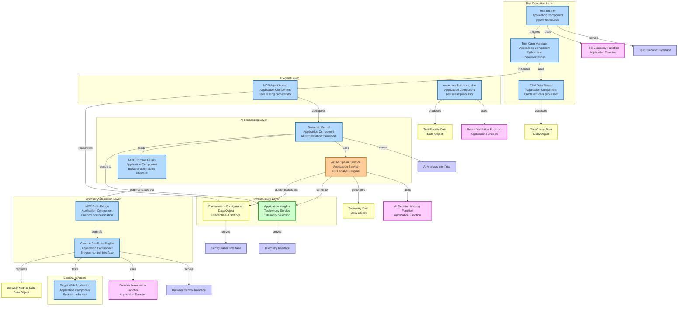

# AI Testing Application - ArchiMate Diagram

## Application Layer Architecture

## ArchiMate Element Mapping

### Application Components
| Component | ArchiMate Type | Description |
|-----------|----------------|-------------|
| Test Runner | Application Component | Encapsulates pytest framework functionality |
| Test Case Manager | Application Component | Manages individual test implementations |
| CSV Data Parser | Application Component | Processes batch test data from CSV files |
| MCP Agent Assert | Application Component | Core testing orchestrator with lifecycle management |
| Assertion Result Handler | Application Component | Processes and formats test outcomes |
| Semantic Kernel | Application Component | AI orchestration framework container |
| MCP Chrome Plugin | Application Component | Browser automation interface component |
| MCP Stdio Bridge | Application Component | Protocol communication bridge |
| Chrome DevTools Engine | Application Component | Browser control and automation |

### Application Services
| Service | ArchiMate Type | Description |
|---------|----------------|-------------|
| Azure OpenAI Service | Application Service | External GPT model providing AI analysis |

### Technology Services
| Service | ArchiMate Type | Description |
|---------|----------------|-------------|
| Application Insights | Technology Service | Azure Monitor telemetry infrastructure |

### Data Objects
| Data Object | ArchiMate Type | Description |
|-------------|----------------|-------------|
| Test Cases Data | Data Object | Structured test case information |
| Test Results Data | Data Object | Formatted test outcomes and analysis |
| Browser Metrics Data | Data Object | Performance and interaction measurements |
| Telemetry Data | Data Object | Operational monitoring information |
| Environment Configuration | Data Object | Credentials and connection settings |

### Application Functions
| Function | ArchiMate Type | Description |
|----------|----------------|-------------|
| Test Discovery Function | Application Function | Automated test case identification |
| AI Decision Making Function | Application Function | Intelligent pass/fail determination |
| Browser Automation Function | Application Function | Web interaction and data extraction |
| Result Validation Function | Application Function | Test outcome verification |

### Application Interfaces
| Interface | ArchiMate Type | Description |
|-----------|----------------|-------------|
| Test Execution Interface | Application Interface | pytest framework API |
| AI Analysis Interface | Application Interface | Semantic Kernel orchestration API |
| Browser Control Interface | Application Interface | Chrome DevTools Protocol API |
| Telemetry Interface | Application Interface | Application Insights logging API |
| Configuration Interface | Application Interface | Environment settings access API |

## ArchiMate Architectural Viewpoints

### Application Cooperation Viewpoint
Shows how application components collaborate to deliver the AI testing capability:
- **Test Runner** orchestrates the entire testing process
- **MCP Agent Assert** serves as the central coordinator
- **Semantic Kernel** manages AI processing workflows
- **Chrome DevTools Engine** provides browser automation

### Application Usage Viewpoint
Demonstrates how the system serves its primary function:
- **External Test Target** ← **Browser Automation** ← **AI Analysis** ← **Test Execution**

### Information Structure Viewpoint
Shows data flow and information dependencies:
- **Test Cases Data** → **Test Results Data** → **Telemetry Data**
- **Browser Metrics Data** → **AI Analysis** → **Decision Output**

### Technology Usage Viewpoint
Illustrates infrastructure dependencies:
- **Application Components** rely on **Azure OpenAI Service**
- **Telemetry** flows to **Application Insights Technology Service**
- **Configuration Data** supports **Authentication** and **Service Setup**

## Key ArchiMate Principles Applied

1. **Layered Architecture**: Clear separation between application and technology layers
2. **Service Orientation**: External services (Azure OpenAI) properly classified
3. **Data Flow**: Explicit data objects showing information lifecycle
4. **Interface Definition**: Clear APIs between major components
5. **Function Decomposition**: Business functions separated from structural elements
6. **Technology Dependencies**: Infrastructure services clearly identified

This ArchiMate representation provides an enterprise architecture view of the AI testing system, suitable for architectural governance and system understanding at the organizational level.