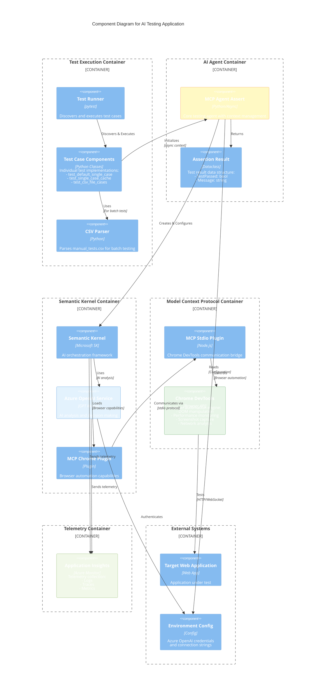

# AI Testing Application - C4 Component Diagram

## Component Level Architecture

## Component Responsibilities

### Test Execution Container
- **Test Runner**: pytest framework orchestrating test discovery and execution
- **Test Case Components**: Individual test implementations with different strategies
- **CSV Parser**: Batch test data processing from external CSV files

### AI Agent Container  
- **MCP Agent Assert**: Central orchestrator with async context management, MCP connection lifecycle
- **Assertion Result**: Standardized result format for test outcomes and AI analysis

### Semantic Kernel Container
- **Semantic Kernel**: Microsoft's AI orchestration framework managing plugins and services
- **Azure OpenAI Service**: GPT model providing intelligent test analysis and decision making
- **MCP Chrome Plugin**: Browser automation capabilities injected as kernel plugin

### Model Context Protocol Container
- **MCP Stdio Plugin**: Node.js bridge implementing MCP protocol for Chrome DevTools
- **Chrome DevTools**: Browser engine providing DOM manipulation, performance monitoring, and network analysis

### Telemetry Container
- **Application Insights**: Azure Monitor collecting logs, traces, and metrics from AI operations

### External Systems
- **Target Web Application**: System under test receiving automated interactions
- **Environment Config**: External configuration providing credentials and connection strings

## Key Interactions

1. **Test Discovery**: pytest discovers test methods and creates test case objects
2. **Agent Initialization**: Test cases initialize MCP Agent with async context management  
3. **Kernel Setup**: Agent configures Semantic Kernel with Azure OpenAI service and MCP plugin
4. **AI Analysis**: Kernel orchestrates AI analysis using GPT model and browser automation
5. **Browser Control**: MCP plugin communicates with Chrome DevTools via stdio protocol
6. **Result Processing**: AI analysis produces structured AssertionResult for pytest validation
7. **Telemetry**: AI operations send telemetry data to Application Insights for monitoring

## C4 Model Compliance

- **Components**: Individual software components with clear responsibilities
- **Containers**: Logical groupings of related components  
- **Relationships**: Explicit communication paths with interaction types
- **External Dependencies**: Clear boundary between internal and external systems
- **Technology Stack**: Specified implementation technologies for each component